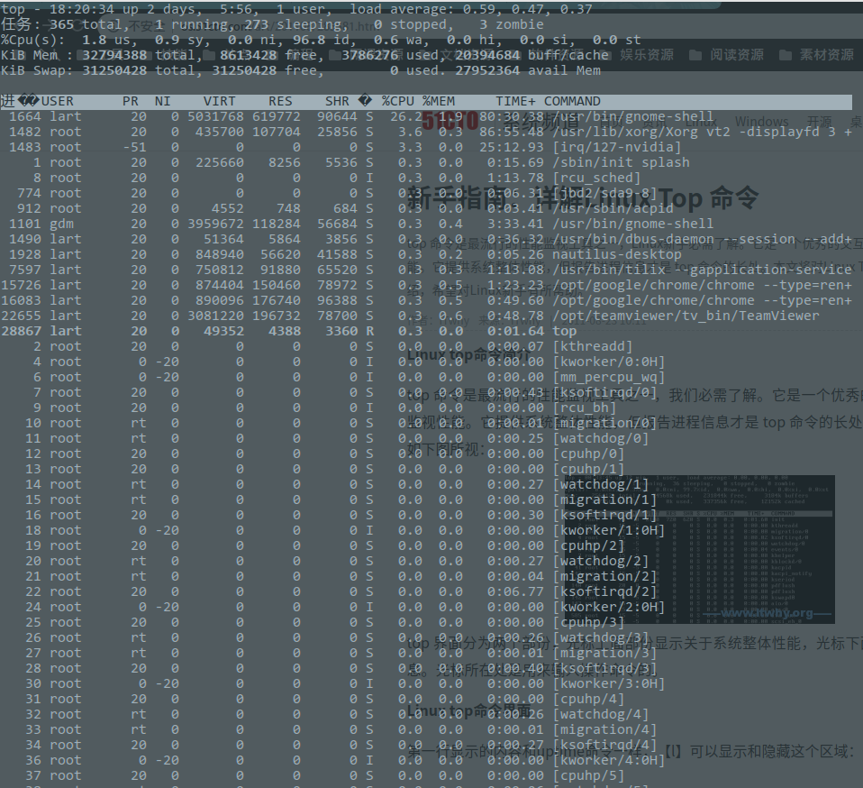
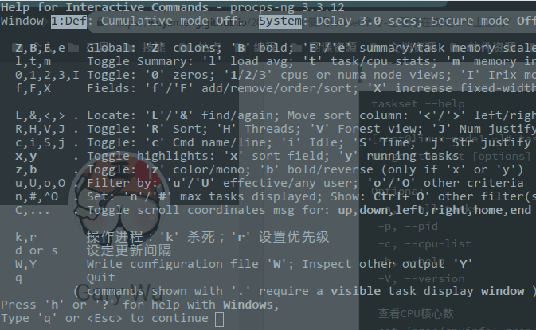

# top指令的使用

## top界面简介



top界面分为两个部份，光标上面部份显示关于系统整体性能，光标下面部份显示各进程信息。光标所在处是用来输入操作命令的。

### 第一行

```sh
top - 20:55:28 up 2 days,  8:31,  1 user,  load average: 1.36, 1.40, 1.01
```

显示的内容和uptime命令一样，`l`可以显示和隐藏这个区域：

* 20:55:28：系统当前时间
* up 2 days, 8:31： 系统开机到现在经过了多少时间
* 1 user： 当前2用户在线
* load average: 1.36, 1.40, 1.01: 系统1分钟、5分钟、15分钟的CPU负载信息

### 第二行

```sh
任务: 375 total,   4 running, 287 sleeping,   0 stopped,   3 zombie
```

* 375 total：当前有38个任务，也就是38个进程
* 4 running：1个进程正在运行
* 287 sleeping：37个进程睡眠
* 0 stopped：停止的进程数
* 3 zombie：僵死的进程数

### 第三行

这一行显示CPU总体信息

```sh
%Cpu(s) : 10.7 us,  2.7 sy,  0.0 ni, 86.1 id,  0.4 wa,  0.0 hi,  0.0 si,  0.0 st
```

* 10.7 us：用户态进程占用CPU时间百分比，改变过优先级的进程CPU时间百分比
* 2.7 sy：内核占用CPU时间百分比
* 0.0 ni：改变过优先级的进程CPU时间百分比。nice是优先级的意思
* 86.1 id：空闲CPU时间百分比, 反映一个系统cpu的闲忙程度, 越大越空闲
* 0.4 wa：I/O等待的CPU时间百分比
* 0.0 hi：CPU硬中断时间百分比
* 0.0 si：CPU软中断时间百分比
* 0.0 st：用于有虚拟cpu的情况，用来指示被虚拟机偷掉的cpu时间

### 第四行

```sh
KiB Mem  : 32794388 total,  8450792 free,  3893432 used, 20450164 buffers
KiB Swap : 31250428 total, 31250428 free,        0 used. 27807536 cached
```

* 32794388 total：物理内存/交换空间总量
* 3893432 used：使用的物理内存量/交换空间
* 8450792 free：空闲的物理内存量
* 20450164 buffers：用作内核缓存的物理内存量
* 27807536 cached：缓冲交换区总量
  * 内存中的内容被换出到交换区，而后又被换入到内存，但使用过的交换区尚未被覆盖，该数值即为这些内容已存在于内存中的交换区的大小。相应的内存再次被换出时可不必再对交换区写入。

## 进程信息

```sh
PID     USER    PR  NI  VIRT    RES     SHR S   %CPU    %MEM    TIME+   COMMAND
11836   root    15  0   2324    1028    800 R   0.3     0.0     0:00.02 top
27225   root    25  0   1494m   696m    11m S   0.3     17.5    2304:03 java
1       root    18  0   2072    620     532 S   0.0     0.0     7:04.48 init
```

* PID：进程的ID(PPID 父进程ID)
* USER：进程所有者
* PR：进程的优先级别，越小越优先被执行
* NI:值
* VIRT：进程占用的虚拟内存
* RES：进程占用的物理内存
* SHR：进程使用的共享内存
* S：进程的状态。D=不可中断的睡眠状态 R=运行 S=睡眠 T=跟踪/停止 Z=僵尸进程
* %CPU：进程占用CPU的使用率
* %MEM：进程使用的物理内存和总内存的百分比
* TIME+：该进程启动后占用的总的CPU时间，即占用CPU使用时间的累加值。
* COMMAND：进程启动命令名称

## 操作指令

* q：退出top命令
* `<Space>`：立即刷新
* s：设置刷新时间间隔
* c：显示命令完全模式
* t:：显示或隐藏进程和CPU状态信息
* m：显示或隐藏内存状态信息
* l：显示或隐藏uptime信息
* f：增加或减少进程显示标志
* S：累计模式，会把已完成或退出的子进程占用的CPU时间累计到父进程的TIME+
* P：按%CPU使用率排行
* T：按TIME+排行
* M：按%MEM排行
* u：指定显示用户进程
* r：修改进程renice值
* k：kill进程
* i：只显示正在运行的进程
* W：保存对top的设置到文件~/.toprc，下次启动将自动调用toprc文件的设置
* h：帮助命令

`h`操作截图:



## 参考链接

* 每天一个linux命令（44）：top命令: <https://www.cnblogs.com/peida/archive/2012/12/24/2831353.html>
* 新手指南：详解Linux Top 命令: <http://os.51cto.com/art/201108/285581.htm>
